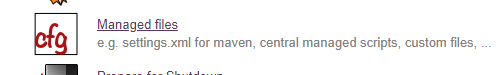
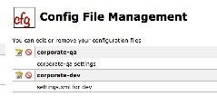
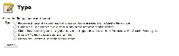
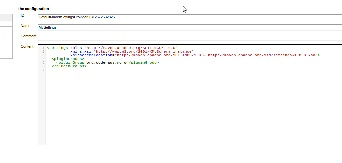
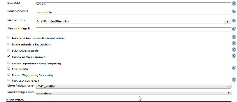
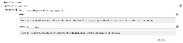
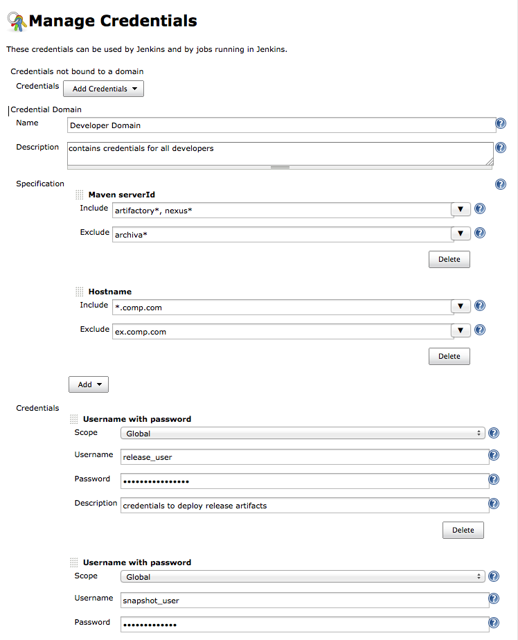
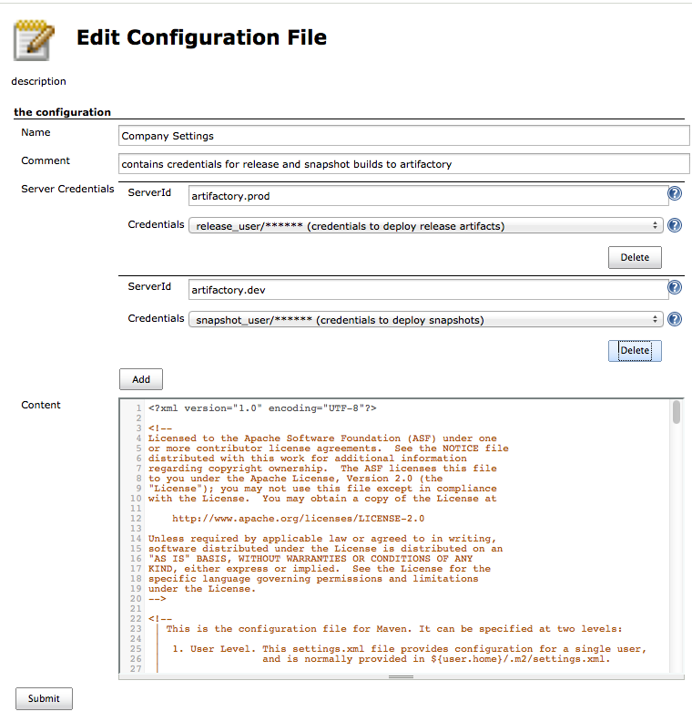
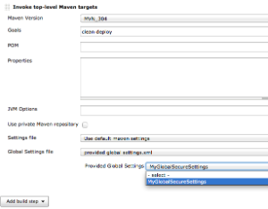
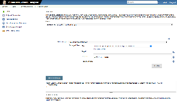

Config File Provider plugin for Jenkins
=======================================

image:https://img.shields.io/jenkins/plugin/v/config-file-provider.svg[link="https://plugins.jenkins.io/config-file-provider"]
image:https://img.shields.io/github/release/jenkinsci/config-file-provider-plugin.svg?label=changelog[link="https://github.com/jenkinsci/config-file-provider-plugin/releases/latest"]
image:https://img.shields.io/jenkins/plugin/i/config-file-provider.svg?color=blue[link="https://plugins.jenkins.io/config-file-provider"]

Adds the ability to provide configuration files (i.e., settings.xml for maven, XML, groovy, custom files, etc.)
loaded through the Jenkins UI which will be copied to the job's workspace.

== How it works

It will allow you to copy various similar configuration files to all
your nodes. It also adds the ability to edit those files through the
Jenkins UI.

=== File Types

In general, you can manage whatever file format you like with this
plugin (except binary), but the UI provides some advanced editing
support for the following file types:

* Maven settings.xml (user and global)
* Plain XML
* Groovy
* JSON
* Custom (plain text)

=== Load your configuration file content.

Choose the "Managed files" in the administration home:

Edit an existing file or add a new file:

Choose the configuration type:

Edit the content:

Configure the Maven plugin to use it:

Provide any config file to a project

=== Maven Server Credentials (since 2.7)

The file types '_Global Maven settings.xml_' and '_Maven settings.xml_'
have built-in support for the
https://plugins.jenkins.io/credentials/[Credentials
Plugin]. When the plugin serves the _settings.xml_ to the maven
execution, the credentials get injected. *This functionality is only
available in the maven builder (e.g. for freestyle projects) and maven
project type*. +
After installation of the
https://plugins.jenkins.io/config-file-provider/[Config
File Provider Plugin], a new Credentials Specification is available and
can be used to mark credentials domain to contain credentials valid for
maven server ids. The "Maven serverId" Specification allows you to
define serverId patterns - this will make it easier to select the
correct credential when configuring the _settings.xml_. +

The current implementation supports "Username with
password"-credentials. If your passwords are
https://maven.apache.org/guides/mini/guide-encryption.html[encrypted by
maven], you can store the encrypted passwords in the same configuration
- but you have to make sure the _settings-security.xml_ is available to
the job, unfortunately maven does not yet provide a way to pass this
file as well, so this file has to be located at the original location
required by maven (<user.home>/.m2)

When configuring the _settings.xml_ (user or global), you can add as
many credential mappings as you wish, as soon as you add at least one
serverId-credentials mapping to a config file all server configs in the
same file will be removed and replaced by the ones you have explicitly
added - this way you are sure which credentials finally end up in the
file used by the jobs.

This example will add two server configurations to your _settings.xml,_
one called 'artifactory.prod' (using 'release_user' with password) and
the other 'artifactory.dev' (using 'snapshot_user' with password). +

Now provided _settings.xml_ with credentials can be used in the project
and builder configuration. A common practice would be to define a global
_settings.xml_ to provide credentials and repository definitions and
have local (default) _settings.xml_ define the location of the local
repo.

== Using the configuration files in Jenkins Pipelines

The configuration files can be used in Jenkins pipeline.

The configuration file can either be stored in a desired file path or
can be stored in a temporary file identified by the given
"`+variable+`".

Sample for a Maven build:

[source,groovy]
----
node {

    git url: 'https://github.com/spring-projects/spring-petclinic.git'

    // install Maven and add it to the path
    env.PATH = "${tool 'M3'}/bin:${env.PATH}"

    configFileProvider(
        [configFile(fileId: 'maven-settings', variable: 'MAVEN_SETTINGS')]) {
        sh 'mvn -s $MAVEN_SETTINGS clean package'
    }

}
----

The "Pipeline Syntax" page helps to write the proper syntax.

== Plugins adding support for new file types

* link:https://plugins.jenkins.io/managed-scripts/[Managed
Script Plugin] — Managed scripts are shell scripts which
are managed centrally by an administrator and can be referenced as a
build step within jobs.

== Extension Point

This plugin makes use of the
`org.jenkinsci.lib.configprovider.ConfigProvider` ExtensionPoint. If you
need to have easy administration of a new file type, just implement this
ExtensionPoint and you're ready to go.

The easiest way to do so is to extend
`org.jenkinsci.lib.configprovider.AbstractConfigProviderImpl` - have a
look at
`org.jenkinsci.plugins.managedscripts.ScriptConfig.ScriptConfigProvider`

#### builds are currently executed on:

* link:https://ci.jenkins.io/blue/organizations/jenkins/Plugins%2Fconfig-file-provider-plugin/[jenkins ci]
